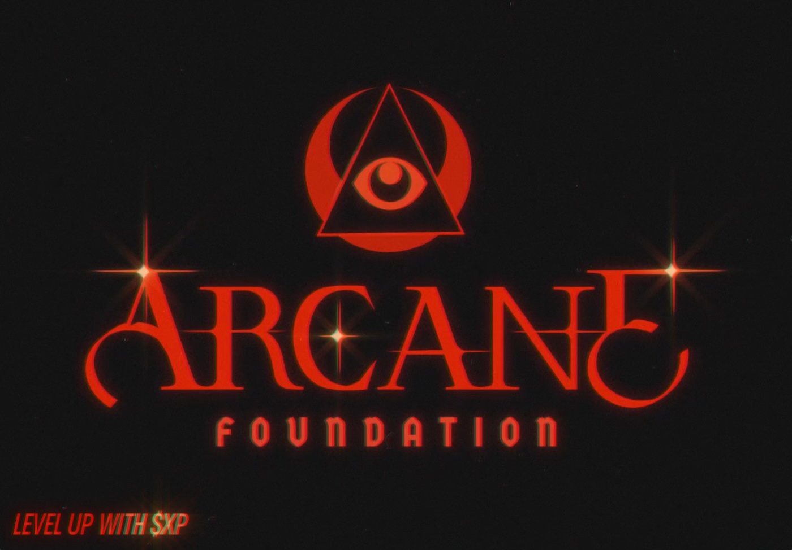

# XP Token

This is the repository for Arcane Foundation's XP token.

## Setup

1. Install Foundry by following the instructions from [their repository](https://github.com/foundry-rs/foundry#installation).
2. Copy the `.env.example` file to `.env` and fill in the variables
3. Install the dependencies by running : `yarn install && forge install`

## Build

```bash
yarn build
```

## Deploy & verify

### Saigon Testnet

Deploy XERC20 (testnet): `forge script solidity/scripts/XERC20DeployTestnet.sol:XERC20DeployTestnet --legacy --via-ir --rpc-url https://saigon-testnet.roninchain.com/rpc --broadcast`

Verify XERC20 (testnet): `forge verify-contract --verifier sourcify --verifier-url https://sourcify.roninchain.com/server/ --chain-id 2021 <addr> XERC20 --via-ir`

Note: Factory was already deployed and put into deployer

### ETH Sepolia Testnet

Deploy and verify XERC20 (testnet): `forge script solidity/scripts/XERC20FactoryDeploy.sol:XERC20FactoryDeploy --legacy --broadcast --verify --slow --via-ir --rpc-url https://rpc2.sepolia.org`

### ETH Mainnet (TBD)

`--legacy --broadcast --verify --slow --via-ir --rpc-url https://eth.llamarpc.com`

### Ronin Mainnet (TBD)

## Credits

Based on: https://github.com/BootNodeDev/xERC20 and https://github.com/defi-wonderland/xERC20
